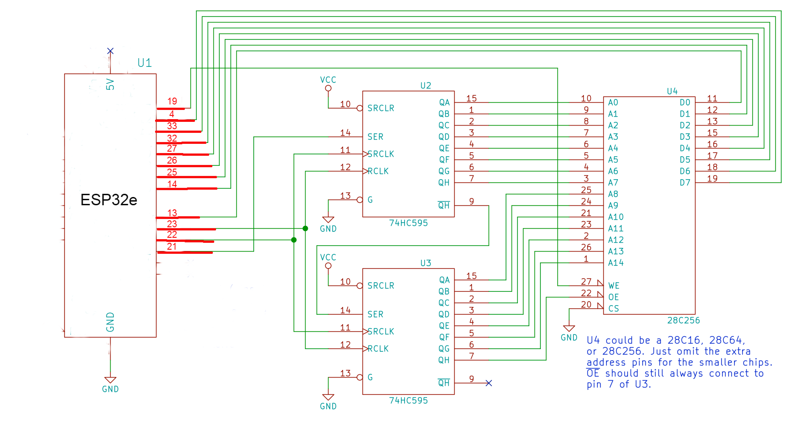

# ESP32 AT28C16 EEPROM Programmer

A collection of adapted Arduino/ESP32 sketches for programming the AT28C16 EEPROM, ported from Ben Eater's classic 8-bit breadboard computer architecture to run on **ESP32 and ESP32-S3** hardware.

---

# ESP32-Ported AT28C16 EEPROM Programmer

Adapted from [Ben Eater's original Arduino EEPROM Programmer](https://github.com/beneater/eeprom-programmer) repository, modified to run on **ESP32** hardware.

---

---

## Hardware Architecture & Wiring

Unlike the original AVR/Arduino setup, this version is designed around the **ESP32 / ESP32-S3** GPIO matrix using standard digital control lines and shift registers.

### Pinout Mapping

| Component / Signal | ESP32 Pin | Description |
| :--- | :--- | :--- |
| **Shift Data (SER)** | GPIO 21 | 74HC595 Data Input (SER) |
| **Shift Clock (SRCLK)** | GPIO 22 | 74HC595 Shift Register Clock (SRCLK) |
| **Shift Latch (RCLK)** | GPIO 23 | 74HC595 Storage Register Clock (RCLK) |
| **Write Enable (WE)** | GPIO 19 | AT28C16 Write Control Line |
| **ESP32e Use Data Bus (D0 - D7)** | GPIO 13, 14, 25, 26, 27, 32, 33, 4 | Bidirectional 8-bit Data Lines |
| **ESP32-S3 Use Data Bus (D0 - D7)** | GPIO 1, 2, 4, 5, 7, 15, 16, 17 | Bidirectional 8-bit Data Lines |
### Power Supply Note
* **5V VCC:** Powered directly via the board's **5V / VBUS** pin (driven by USB) to supply the necessary voltage for reliable AT28C16 write operations.
* **Logic Levels:** Ensure your 74HC595 shift registers and EEPROM share a clean 5V rail.

---

## Project Modules

1. **`eeprom-programmer.ino`**
   * Core diagnostic sketch to verify read/write cycles, address shifting, and serial monitor debugging.
2. **`multiplexed-display.ino`**
   * Generates binary-to-7-segment lookup tables for multiplexed display drivers.
3. **`microcode-eeprom-programmer.ino`**
   * Configures instruction step and opcode control matrices for the 8-bit ALU architecture.
4. **`microcode-eeprom-with-flags.ino`**
   * Expands the control word map to incorporate conditional flag checks (Z and C status bits).

---

## Usage Instructions

1. Open any sketch in the **Arduino IDE** or **PlatformIO**.
2. Select your specific ESP32/ESP32-S3 board model and correct COM port.
3. Compile and upload the sketch. Open the Serial Monitor at **115200 baud** to verify execution progress.

⚠️ ESP32-S3 Hardware Warning:
Do not use GPIO 26 through 32 for general input/output (such as sensors, relays, or data lines) on an ESP32-S3. Unlike the classic ESP32, these pins are internally reserved for the chip's built-in SPI Flash and PSRAM. Using them for external data pins will cause boot loops, memory crashes, or permanent flash corruption. For safe general-purpose I/O, stick to lower-numbered free GPIOs (GPIO 1, GPIO 2, GPIO 4, GPIO 5, GPIO 7, GPIO 15, GPIO 16, GPIO 17).
